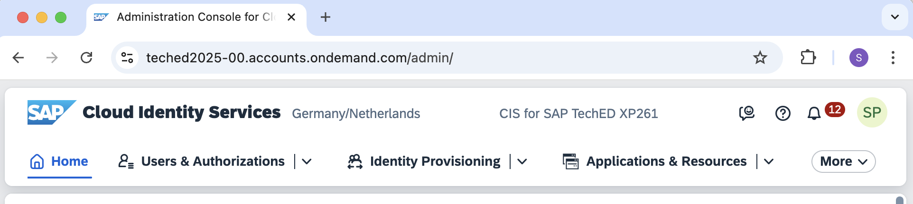
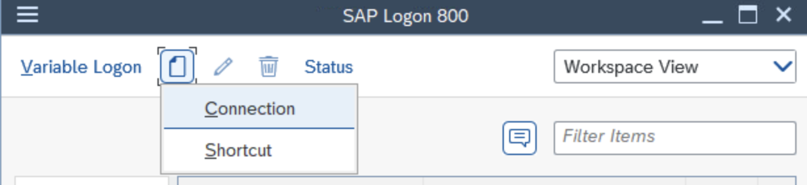
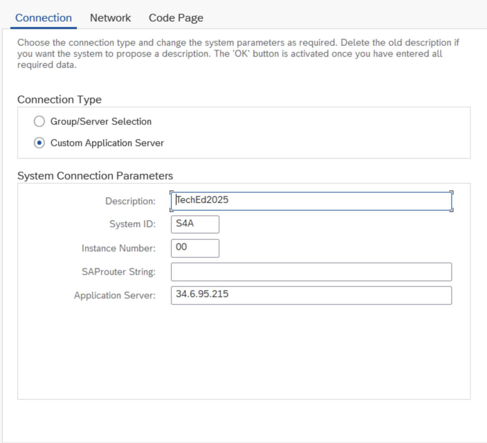
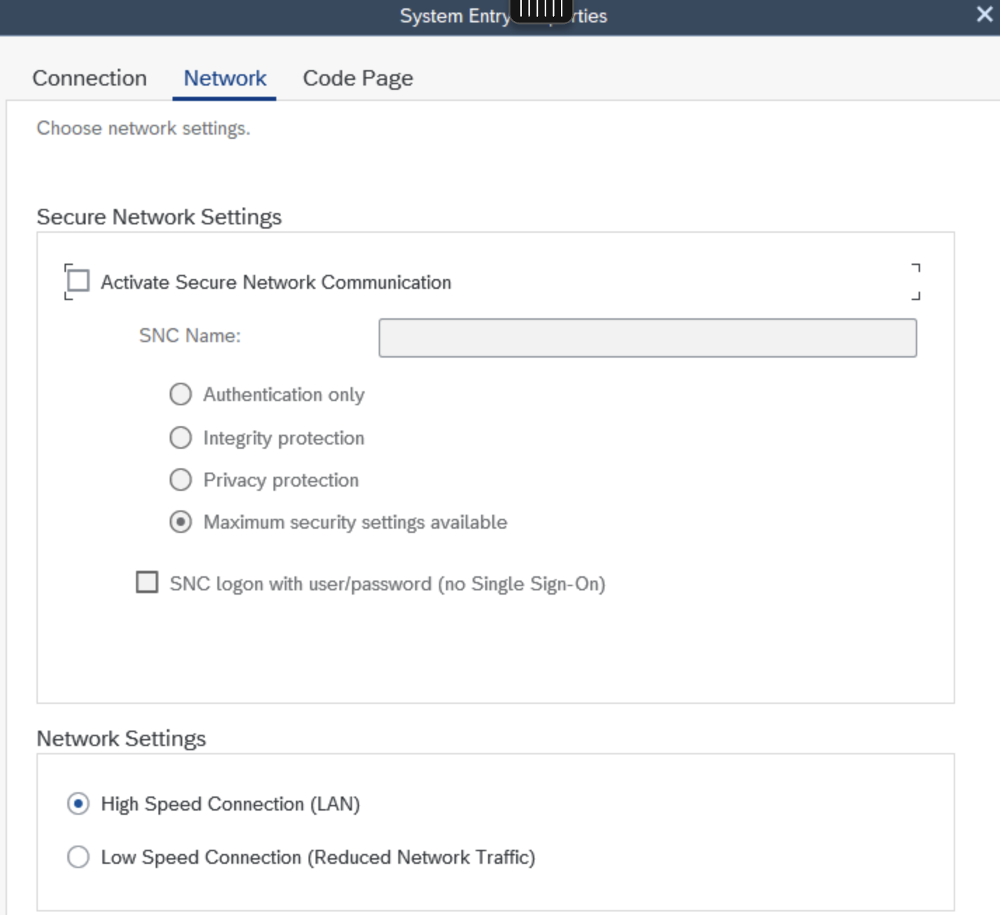
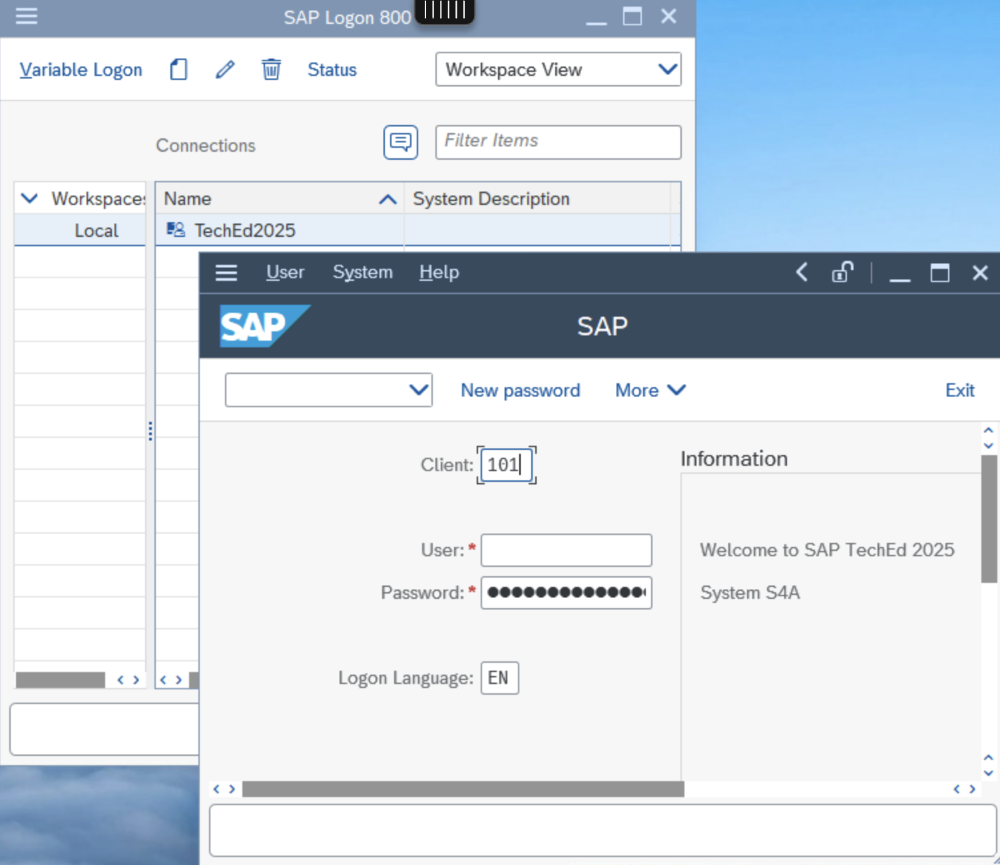
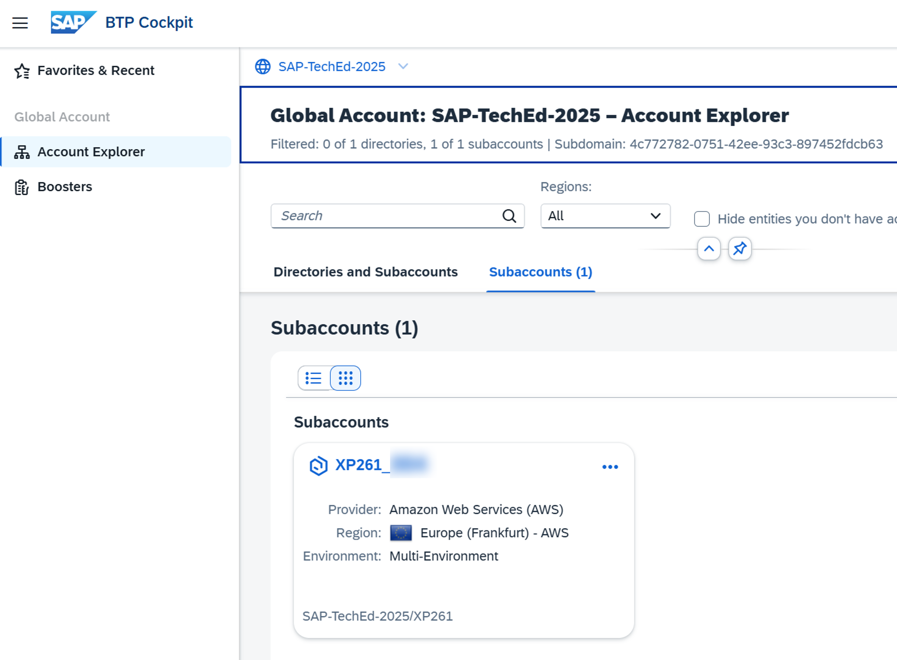

# Getting started

We have chosen this scenario because it follows the best practices for integrating an identity management solution into an SAP landscape. Throughout these exercises you will learn how to setup the identity access management flows between a Microsoft Entra ID tenant and your SAP landscape. As per our [reference architecture](https://architecture.learning.sap.com/docs/ref-arch/20c6b29b1e), the SAP Cloud Identity Services tenant are positioned in front of your SAP landscape and serve as the designated Identity and Access Management interface for SAP SaaS integrations. 

SAP Cloud Identity Services (SCI) are a group of services of SAP Business Technology Platform (SAP BTP), which enable you to integrate identity and access management between systems. The goal is to provide a seamless single sign-on experience across systems while ensuring that system and data access are secure. SAP Cloud Identity Services include Identity Authentication (IAS), Identity Provisioning (IPS), Identity Directory (IdDS), and Authorization Management (AMS).

- [Accessing the landscape](#accessing-the-landscape)
   - [Accessing Microsoft Entra ID](#accessing-microsoft-entra-id)
      - [Setup Multifactor Authentication (MFA)](#setup-multifactor-authentication-mfa)
   - [Accessing your SAP Cloud Identity Services tenant](#accessing-your-sap-cloud-identity-services-tenant)
   - [Accessing SAP SuccessFactors tenant](#accessing-sap-successfactors-tenant)
   - [Accessing SAP S/4HANA Cloud Private Edition](#accessing-sap-s4hana-cloud-private-edition)
   - [Accessing your BTP subaccount](#accessing-your-btp-subaccount)
- [Summary](#summary)

## Accessing the landscape
Please follow the steps described in this section to prepare your user account for accessing the systems in this hands-on session.

You will get access to the following systems:  [Microsoft EntraID](#accessing-microsoft-entra-id), [SAP Cloud Identity Services](#accessing-your-sap-cloud-identity-services-tenant), [SAP SuccessFactors](#accessing-sap-successfactors-tenant), [SAP S/4HANA Private Edition](#accessing-sap-s4hana-cloud-private-edition) and the [BTP subaccount](#accessing-your-btp-subaccount). 

### Accessing Microsoft Entra ID

#### Setup Multifactor Authentication (MFA)

| Step   | Description                | Screenshot |
| :----- | :------------------------- | :--------- |
| 0.1    | Open a new browser windows and go to the [My Account Web Portal](https://myaccount.microsoft.com/) to setup MFA for your Entra administrator user.  Enter `admin<NNN>@bestruncorp.onmicrosoft.com` for the user name. Replace `<NNN>` with the number of your seat, for example admin045@bestruncorp.onmicrosoft.com.  Click **Next**.||
| 0.2    | Enter your Entra admin initial login password.  Replace `<NNN>` at the end of the password with the number of your seat.  Click **Sign in**.||
| 0.3    | Click **Next**. ||
| 0.4    | Click **Next**. ||
| 0.5    | Click **Next**. ||
| 0.6    | On your mobile phone, launch the *Authenticator* app.  Press the **+** button.||
| 0.7    | Select **Work or school account** and press **Scan QR code**.||
| 0.8    | Scan the QR Code with your mobile device.||
| 0.9    | Click **Next**. ||
| 0.10    | A randon number is generated. ||
| 0.11    | Enter the number in the Authenticator app on the mobile device.||
| 0.12   | Click **Next**. ||
| 0.13   | Your user account is now setup for MFA.||
| 0.14   | Close the browser tab.||

### Accessing your SAP Cloud Identity Services tenant 

1. Search for the internet browser on your computer and navigate to your SCI administrative console. The SAP Cloud Identity Service tenant URL is specific for your seat in the workshop room. 
URL pattern: https://bestrun-`<NN>`.accounts.ondemand.com/admin/ 
Replace `<NN>` with your seat number, for example `05` or `31`.

| Seat         | SCI tenant | 
|--------------|:-----:|
| 01|  https://bestruncorp-01.accounts.ondemand.com/admin/   |        
| 02|  https://bestruncorp-02.accounts.ondemand.com/admin/   |       
| 03|  https://bestruncorp-03.accounts.ondemand.com/admin/   |        
| 04|  https://bestruncorp-04.accounts.ondemand.com/admin/   |        
| 05|  https://bestruncorp-05.accounts.ondemand.com/admin/   |        
| 06|  https://bestruncorp-06.accounts.ondemand.com/admin/   |        
| 07|  https://bestruncorp-07.accounts.ondemand.com/admin/   |        
| 08|  https://bestruncorp-08.accounts.ondemand.com/admin/   |        
| 09|  https://bestruncorp-09.accounts.ondemand.com/admin/   |        
| 10|  https://bestruncorp-10.accounts.ondemand.com/admin/   |        
| 11|  https://bestruncorp-11.accounts.ondemand.com/admin/   |        
| 12|  https://bestruncorp-12.accounts.ondemand.com/admin/   |        
| 13|  https://bestruncorp-13.accounts.ondemand.com/admin/   |        
| 14|  https://bestruncorp-14.accounts.ondemand.com/admin/   |        
| 15|  https://bestruncorp-15.accounts.ondemand.com/admin/   |        
| 16|  https://bestruncorp-16.accounts.ondemand.com/admin/   |        
| 17|  https://bestruncorp-17.accounts.ondemand.com/admin/   |        
| 18|  https://bestruncorp-18.accounts.ondemand.com/admin/   |        
| 19|  https://bestruncorp-19.accounts.ondemand.com/admin/   |        
| 20|  https://bestruncorp-20.accounts.ondemand.com/admin/   |        
| 21|  https://bestruncorp-21.accounts.ondemand.com/admin/   |        
| 22|  https://bestruncorp-22.accounts.ondemand.com/admin/   |       
| 23|  https://bestruncorp-23.accounts.ondemand.com/admin/   |        
| 24|  https://bestruncorp-24.accounts.ondemand.com/admin/   |        
| 25|  https://bestruncorp-25.accounts.ondemand.com/admin/   |        
| 26|  https://bestruncorp-26.accounts.ondemand.com/admin/   |       
| 27|  https://bestruncorp-27.accounts.ondemand.com/admin/   |        
| 28|  https://bestruncorp-28.accounts.ondemand.com/admin/   |       
| 29|  https://bestruncorp-29.accounts.ondemand.com/admin/   |      
| 30|  https://bestruncorp-30.accounts.ondemand.com/admin/   |       
| 31|  https://bestruncorp-31.accounts.ondemand.com/admin/   |        
| 32|  https://bestruncorp-32.accounts.ondemand.com/admin/   |        
| 33|  https://bestruncorp-33.accounts.ondemand.com/admin/   |       
| 34|  https://bestruncorp-34.accounts.ondemand.com/admin/   |       
| 35|  https://bestruncorp-35.accounts.ondemand.com/admin/   |      
| 36|  https://bestruncorp-36.accounts.ondemand.com/admin/   |   
| 37|  https://bestruncorp-37.accounts.ondemand.com/admin/   |        
| 38|  https://bestruncorp-38.accounts.ondemand.com/admin/   |        
| 39|  https://bestruncorp-39.accounts.ondemand.com/admin/   |      
| 40|  https://bestruncorp-40.accounts.ondemand.com/admin/   |      

2. Type the username and password and press **Log On**

   

3. You have access to the SAP Cloud Identity Services administrative console.
   
   
   
### Accessing SAP SuccessFactors tenant
Search for the internet browser on your computer and navigate to your SAP SFSF tenant.

Unlike the previous exercise, we will use a shared SAP SFSF tenant 

URL: https://hcm-eu10-sales.hr.cloud.sap/login?company=SFLAP062575

 

### Accessing SAP S/4HANA Cloud Private Edition

Search for the SAP Logon icon  on your desktop. 

Create a new connection:

Add the following details:

| <!-- --> | <!-- --> |
| --- | --- |
| Description| TechEd 2025 |  
| System ID| S4A |        
| Instance| 00 |       
| IP| s4xp261.tdc.sap.com |        
| Client | 101 | 

Now that you have created the new connection let's log in! 
| <!-- --> | <!-- --> |
| --- | --- |
| Client | 101 | 
| User | XP261-`<NNN>`. Replace `<NNN>` with your seat number, for example XP261-`045`. |

### Accessing your BTP subaccount

On your internet browser navigate to the global account tenant.

https://emea.cockpit.btp.cloud.sap/cockpit/?idp=teched2025-00.accounts.ondemand.com#/globalaccount/4c772782-0751-42ee-93c3-897452fdcb63/ 

Login with the user xp261-`<NNN>`@education.cloud.sap from your subaccount's platform identity provider (https://teched2025-00.accounts.ondemand.com). 
Replace `<NNN>` with your seat number, for example xp261-`016`@education.cloud.sap for sear 16. 
You will find a subbacout that coresonds to your seat number:

## Summary

Congratulations for completing the initial setup steps. Now get started with exercise [exercise 1](../ex1/README.md), or go back to the [overview](../README.md).

