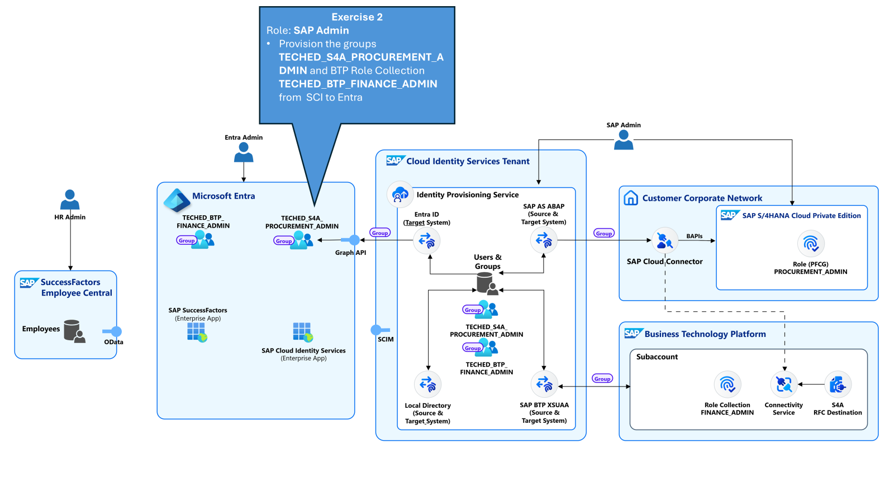
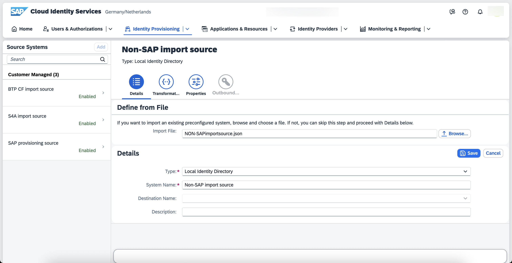
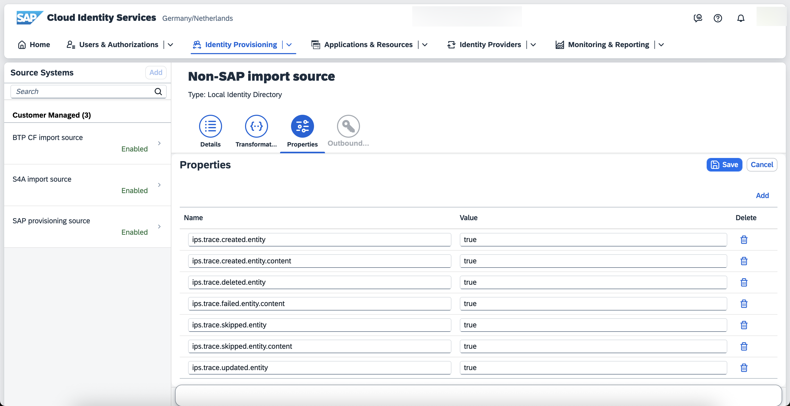
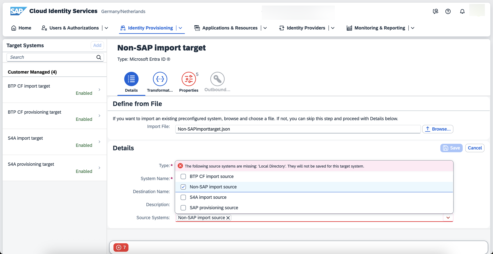
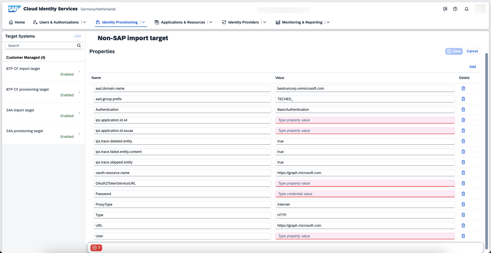
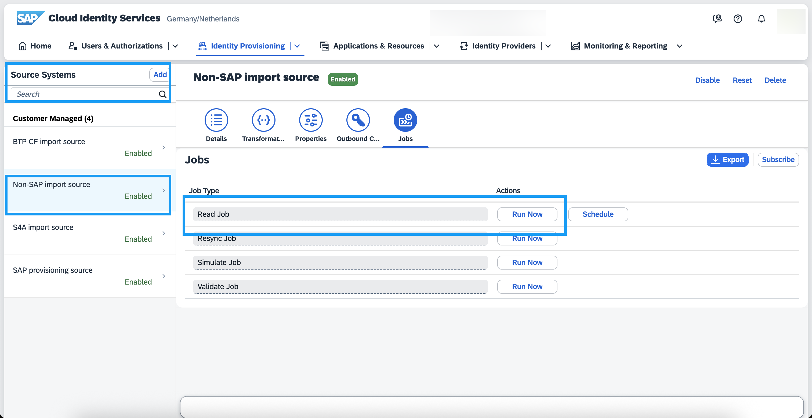
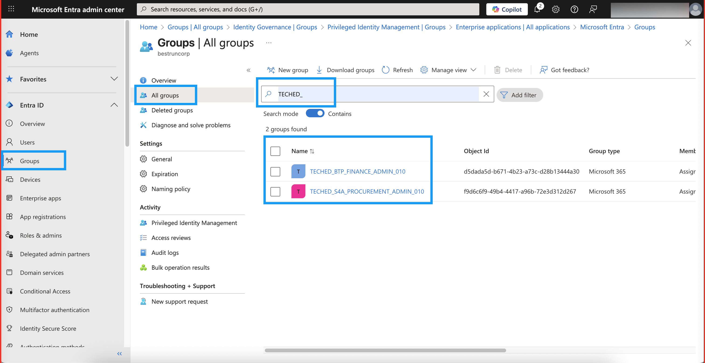

# Exercise 2 - Provision SAP back-end roles to Microsoft Entra ID

*Estimated Time: **15 min***

In the previous exercise you have imported all the necessary authorizations from our backend systems. Now you have to synchronize them to the identity management solution, your Entra ID tenant.

## Table of Contents
- [2.1 Systems for Microsoft Entra ID import](#21--systems-for-microsoft-entra-id-import)
- [2.2 Trigger groups import to Entra ID](#22-trigger-groups-import-to-entra-id)
- [Summary](#summary)

## 2.1 Systems for Microsoft Entra ID import  

### 2.1.1 Create one IPS source system for syncing authorizations to Entra ID

With the previously created systems you are importing in the Identity Directory all the authorizations from the SAP back-end applications. Because you want to sync these SAP authorization to Entra ID, you will create a dedicated source system representing the IdDS.

1. Navigate to the SCI administrative console and from the third tab Identity Provisioning please choose **Source Systems**. Click on the **Add** button and then click on Browse and search for the **Non-SAP import source** file. 

2. Navigate  to the third tab  **Properties** tab.  Note that for this system type you do not need to specify connection details. This is because the local store inside this tenant is used. You can change all the values of the available properties to *true*. What this does, is setting the debugging level at the highest level.

5. Now save your system. 

### 2.1.2 Create one IPS target system for provisioning to Entra ID. 
1. Navigate to your target systems. Click on the **Add** button and then click on Browse and search for the **Non-SAP import target** file that you previously saved.

2. For the source system, choose from the drop-down menu the **Non-SAP import source** system that you created at earlier. This will ensure that the entries coming from the Identity Directory will be provisioned to this system.

3. Navigate to the Properties Tab and add the values for the properties that are marked in red. 

The values for the properties *ips.application.id.s4* and *ips.application.id.xsuaa* are the ones that you wrote in the previous steps. You can find these values as follows:
* for *ips.application.id.xsuuaa* navigate to your **BTP CF import source**  source system and search for the ips.application.id property, and copy the value. 
* for *ips.application.id.s4* navigate to your **S4A import source**  source system and search for the ips.application.id property, and copy the value. 

For the rest of the properties, use the XP261 keys.xslx file that you saved previously.

 

4. Save your system. 

## 2.2 Trigger groups import to Entra ID

1. Navigate to your **Source Systems**.
2. Choose the source system **Non-SAP import source** and navigate to the tab **Jobs**. 
3. Press on **Run Now** for the job type **Read Job**. 

 

4. Navigate to Provisioning Logs and check the provisioning status and the details. You will notice that you have only created groups in your **BestRunCorp Tenant**. 

 

5. Go back to your browser tab where you logged on to the Entra admin center in the [Getting Started](..\ex0\README.md) section, or [login again](https://entra.microsoft.com) as the Entra administrator user **admin`NNN`@bestruncorp.onmicrosoft.com**.

 

Replace `NNN` with the number of your seat, for example **admin`045`@bestruncorp.onmicrosoft.com**.  

Select **Groups** from the navigation menu.

In the search bar, filter by your seat number `NNN`, for example `043`. 

 

Notice that the number and name of groups is similar to the one on the SCI tenant.

## Summary

You've now provisioned the SAP groups to your identity management solution. Continue with the next exercise to assign these authorizations to users. 

Continue to - [Exercise 3 - Onboard a new employee in SAP SuccessFactors ](../ex3/README.md), or go back to the [overview](../README.md).
