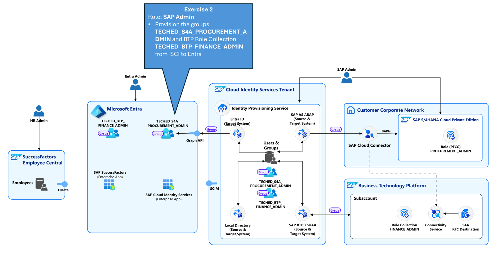
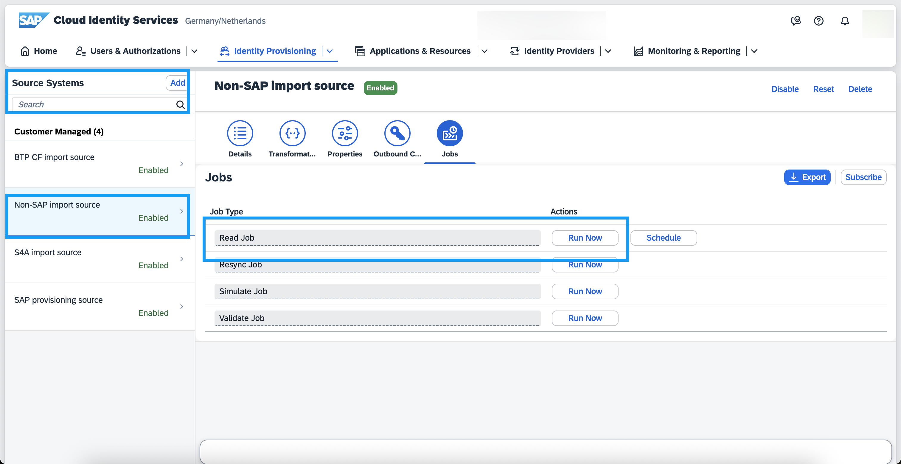
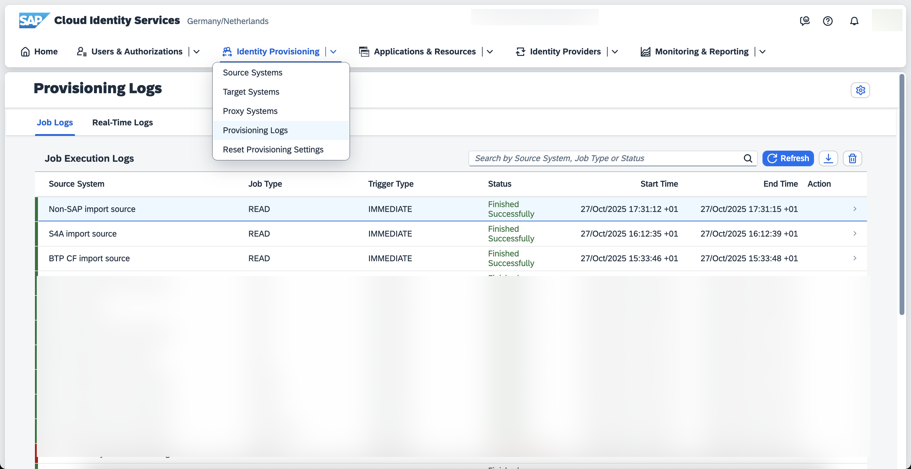
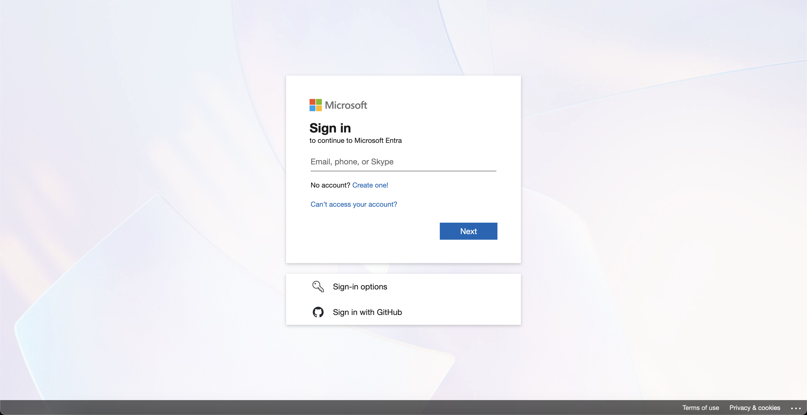
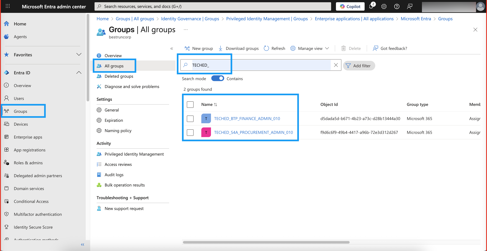

# Exercise 2 - Provision SAP back-end roles to Microsoft Entra ID

*Estimated Time: **15 min***

In the previous exercise you have imported all the necessary authorizations from our backend systems. Now you have to synchronize them to the identity management solution, your Entra ID tenant.

## Table of Contents
- [2.1 Trigger groups import to Entra ID](#21-trigger-groups-import-to-entra-id)
- [Summary](#summary)

## 2.1 Trigger groups import to Entra ID

1. Navigate to your **Source Systems**.
2. Choose the source system **Non-SAP import source** and navigate to the tab **Jobs**. 
3. Press on **Run Now** for the job type **Read Job**. 

 

4. Navigate to Provisioning Logs and check the provisioning status and the details. You will notice that you have only created groups in your **BestRunCorp Tenant**. 

 

5. Go back to your browser tab where you logged on to the Entra admin center in the [Getting Started](..\ex0\README.md) section, or [login again](https://entra.microsoft.com) as the Entra administrator user **admin`NNN`@bestruncorp.onmicrosoft.com**.

 

Replace `NNN` with the number of your seat, for example **admin`045`@bestruncorp.onmicrosoft.com**.  

Select **Groups** from the navigation menu.

In the search bar, filter by your seat number `NNN`, for example `043`.

 

Notice that the number and name of groups is similar to the one on the SCI tenant.

## Summary

You've now provisioned the SAP groups to your identity management solution. Continue with the next exercise to assign these authorizations to users. 

Continue to - [Exercise 3 - Onboard a new employee in SAP SuccessFactors ](../ex3/README.md), or go back to the [overview](../README.md).
