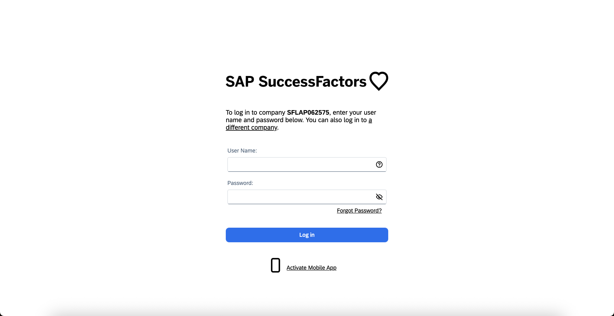
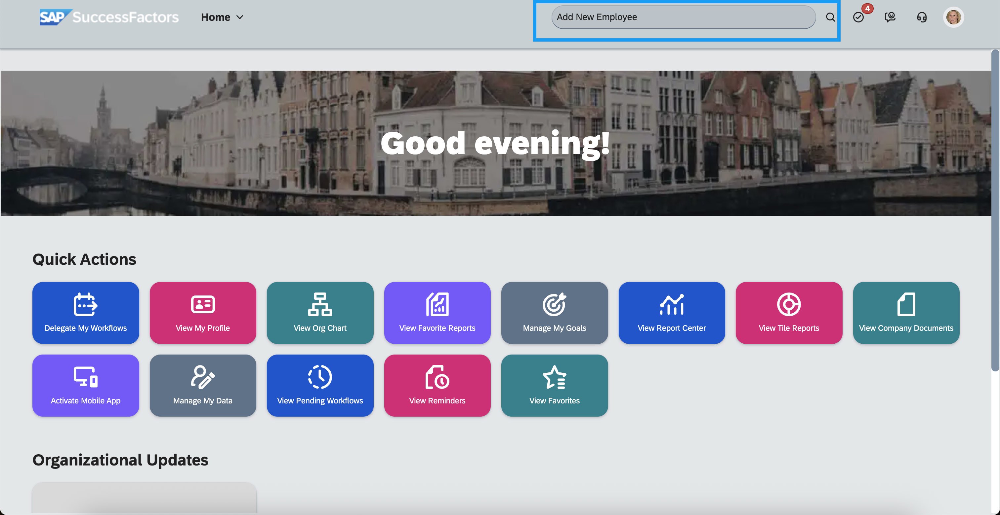
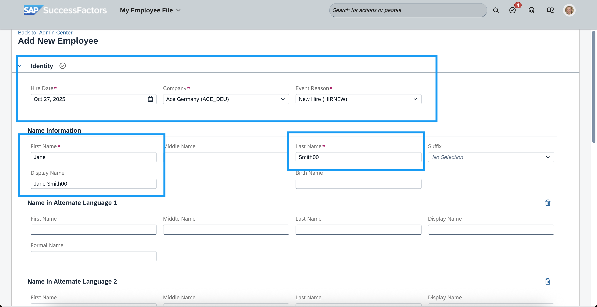
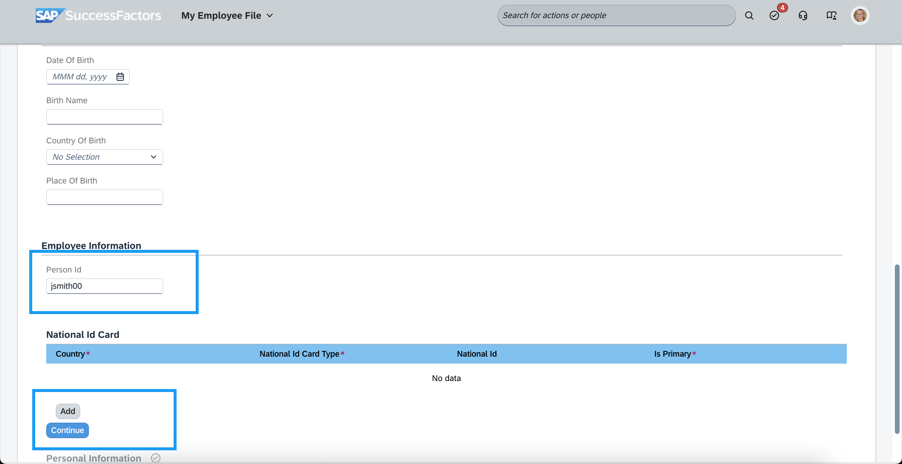
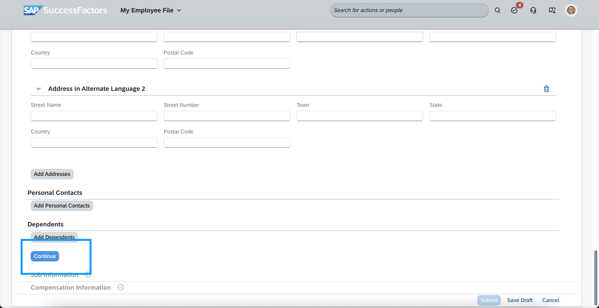
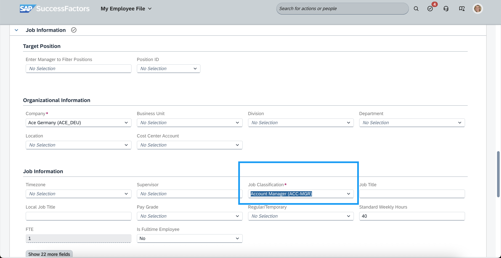
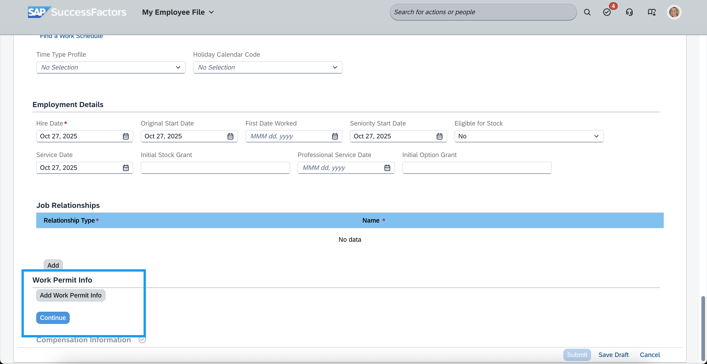
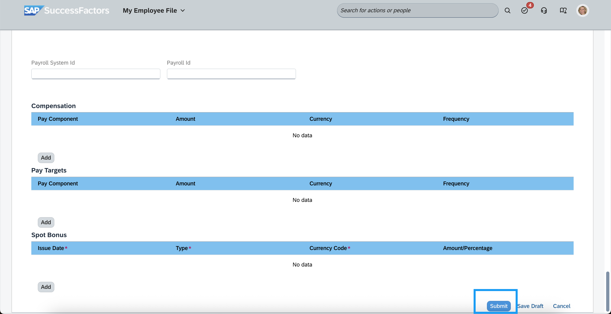
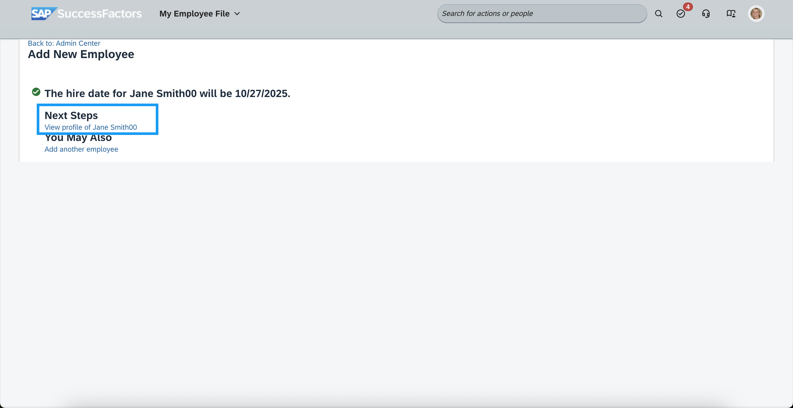
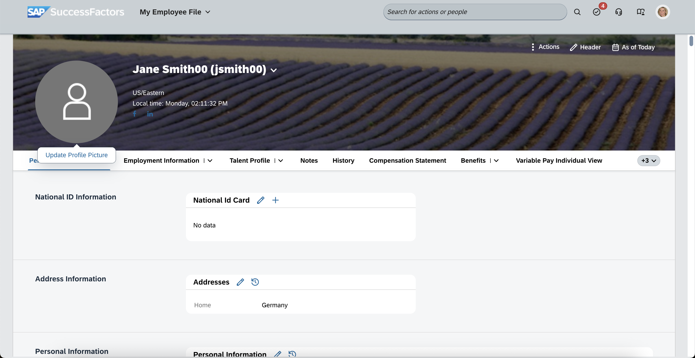

# Exercise 3 - Onboard a new employee in SAP SuccessFactors

In this exercise, you will onboard the new employee in the scenario with the name Jane Smit&lt;`NNN`&gt;. `NNN` will be replaced with your seat number, for example `Jane Smith045`.

## Table of Contents
- [3.1 Create a new employee in SAP SuccessFactors](#31-create-a-new-employee-in-sap-successfactors)
- [Summary](#summary)

## 3.1 Create a new employee in SAP SuccessFactors

1. [Login to SuccessFactors](https://hcm-eu10-sales.hr.cloud.sap/login?company=SFLAP062575) as the HR administrator user `admin`.  

2. In the Admin Center, start typing `Add New Employee` in the search bar. Select the action <b>Add New Employee</b> from the list.

3. Enter the follwing values. and replace `NNN` with your seat number:  <ul><li><b>Hire Date</b>: keep the default for today</li><li><b>Company</b>: Ace Germany</li><li><b>Event Reason</b>: New Hire (HIRNEW)</li><li><b>First Name</b>: Jane</li><li><b>Last Name</b>: Smith&lt;`NNN`&gt;</li><li><b>Display Name</b>: Jane Smith&lt;`NNN`&gt;</li></ul> 

4. Scroll down and enter the <b>Person Id</b>: jsmith&lt;`NNN`&gt;.  Replace `NNN` with your seat number.

5. Scroll down and click <b>Continue</b>  
 

6. Select a value for <b>Job Classification<b> from the list, for example `Account Manager (ACC-MGR)`.  

7. Scroll down and click <b>Continue</b>  

8. Click on <b>Submit</b>.  

9. Click the link <b>View Profile of Jane Smith&lt;`NNN`&gt;</b>.
 

10. Remeber the person Id <b>jsmith&lt;`NNN`&gt;</b> of the new employee.  You will need it in the next exercise. 
  

## Summary

You've successfully onboard the new employee. In the next exercise you will provision the user from SAP SFSF to Microsoft Entra ID, and assign it to the previously provisioned group from SCI using an access package.

Continue with [Exercise 4](../ex4/README.md).

