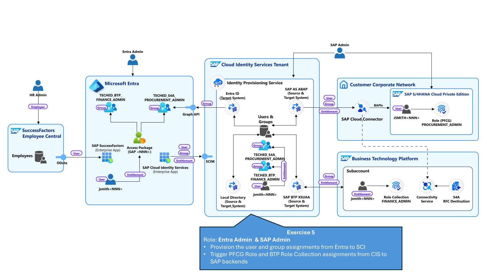

# Exercise 5 - Provisioning to SAP back-end systems

*Estimated Time: **5 min***

In this exercise, you will provision the new user with the two new assignments to the SAP target systens. 

## Table of Contents
- [5.1 Trigger user and group assignment to the SAP systems](#51-trigger-user-and-group-assignment-to-the-sap-systems)
- [5.2 Check user creation and group assignment in the back-end](#52-check-user-creation-and-group-assignment-in-the-back-end)
- [Summary](#summary)

## 5.1 Trigger user and group assignment to the SAP systems

 Navigate to the SAP SCI administration console. 

1. From the third tab Identity Provisioning please choose **Source Systems**.
2. Choose the source system **SAP provisioning source** and navigate to the tab **Jobs**. 

3. Press on **Run Now** for the job type **Read Job**. 

4. Navigate to Provisioning Logs and check the provisioning status and the details. 

When analyzing the details you will notice that in each target solution one user was created and one group was updated. 

## 5.2 Check user creation and group assignment in the back-end

In this exercise you will check in the back-end systems that the users are created and they have the assigned authorizations. 

### Status in SAP S/4HANA PCE system 

1. Navigate to your SAP S/4HANA PCE system and **Execute** the **SU01** transaction.

2. Search your user, by using the email address for example: 

3. Press **Enter**

4. Press **Display**

5. Navigate to **Roles** and check that the **Procurement_Admin** role is assigned. 

### Status in the SAP BTP subaccount 

1. Navigate to your SAP BTP subaccount

2. Click on **Users**

3. Identify your user and check the **Role Collections** assigned. 

## Summary

Congratulations! You have now successfully configured and tested your end to end provisioning flow. 

